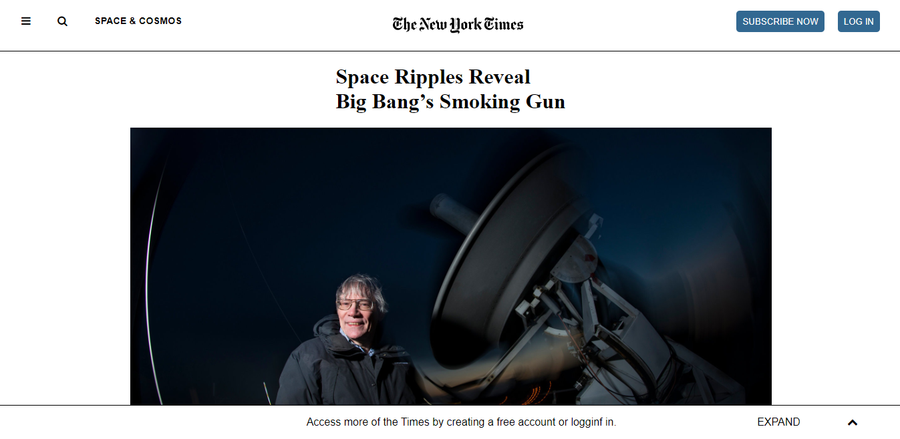

# New York Times Clone Webpage

> This project is a clone of New York Times webpage.

The essence of the project is to validate the use of CSS flexbox and grid to develop a webpage. This webpage contains Header, Article and Footer. The Header Section contains several icons, NYT logo and buttons to login or sign-up. The Article Section is the main part of the webpage where all article images, videos and paraghraphs have laid out. The Footer Section has different links to navigate other pages of the webpage. The Structure of the webpages has been structured by using Grid and Flexbox.

## Built With

- HTML5,
- CSS3,

## Live Demo

[Live Demo Link](https://livedemo.com)

## Getting Started

Click once on the [Live Demo Link](https://livedemo.com)

## Authors

👤 **Author1**

- GitHub:[@github/3rkeen](https://github.com/3rkeen)
- Twitter:[@twitter/3rkeen](https://twitter.com/3rkeen)
- Linkedin:[linkedin/ErkinSheraliev](https://www.linkedin.com/in/erkin-sheraliev-9122631a0/)

👤 **Author2**

- Github: [@githubhandle](https://github.com/Jmagero)
- Twitter: [@twitterhandle](https://twitter.com/MagzCelyn)
- Linkedin: [linkedin](https://www.linkedin.com/in/jocyline-magero-9592b0145/)

## 🤝 Contributing

Contributions, issues and feature requests are welcome!

Feel free to check the [issues page](https://github.com/3rkeen/New-York-Times-Clone/issues).

## Show your support

Give a ⭐️ if you like this project!
